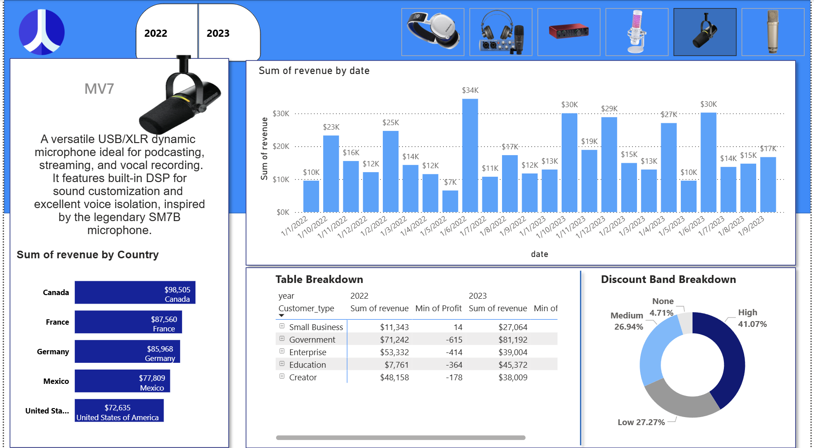

# Audio-Gear-Sales-Analysis
## 📌 Executive Summary
This project is an end-to-end data analysis solution for a global audio equipment retailer. The goal was to analyze sales performance across different regions, product categories, and discount bands to identify revenue drivers and optimize pricing strategies.

The project transforms raw CSV sales records into an interactive **Power BI Dashboard**, powered by a **SQL** transformation layer that handles data cleaning and financial calculations.

---

## 📊 Dashboard Showcase

### 1. Sales Overview
*A high-level view of performance by Country, Product, and Date.*




---

## 🛠️ Technical Architecture

The workflow follows a standard ETL (Extract, Transform, Load) process:

1.  **Extract:** Raw data consists of three CSV files (`product_data`, `product_sales`, `discount_data`).
2.  **Transform (SQL):** * Joined disjointed datasets using `LEFT JOIN`.
    * Cleaned inconsistent text formatting (e.g., " Low " vs "low") using `TRIM()` and `LOWER()`.
    * Calculated **Net Revenue** by applying dynamic percentage discounts based on the month and band.
3.  **Load & Visualize (Power BI):** Imported the SQL query results into Power BI to build the interactive report.

---

## 🔍 Key Insights Derived

* **Discount Strategy:** Products sold under the "High" discount band generated significant volume but lower profit margins compared to "Medium" band sales.
* **Top Performer:** The Scarlett 2i2 was the highest revenue-generating asset, particularly in the Canada market.


---

## 💻 SQL Logic Highlights

The core analysis relies on this SQL transformation logic (found in `sql/queries.sql`):

```sql
/* Handling Data Quality Issues in Joins */
JOIN discount_data dd 
    ON TRIM(LOWER(dd.Discount_Band)) = TRIM(LOWER(ss.Discount_Band))
    AND TRIM(dd.Month) = TRIM(ss.Month_Name);
